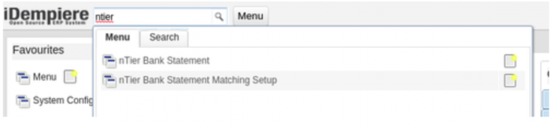
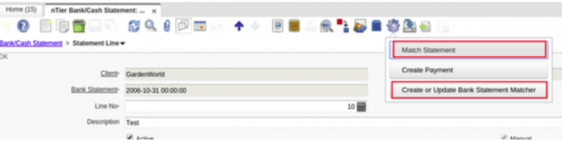

# Bank Statement Matching

---

Riferimenti
*link pubblico            : http://wiki.idempiere.org/en/Plugin:_Bank_Statement_Matching
*link jar                 : /opt/repos/idempiere-download/plugin-standard/Bank Statement Matching/
*link source idemp italia : https://bitbucket.org/consulnet/plugin-standard.za.co.ntier.bankmatchv
*versione idempiere       : idempiere 3.1
*versione zk supportata   : da verificare
*link repository italia   : none

---

## Descrizione

```
- Si prega di consultare il video https://www.youtube.com/watch?v=S5nJ6xeWa28 per le         istruzioni su come utilizzare questo plugin.
- Estratti conto bancari, che in genere vengono importati, possono contenere molte linee.
- Ogni conto in banca è associato a una o più regole di congruenza.
- Ogni regola può corrispondere parte della descrizione (o racconto) su una linea estratto   conto bancario.
- Se la descrizione corrisponde a una linea particolare dell'estratto conto, allora:
     - Il campo di Business Partner può essere compilato automaticamente sulla linea.
     - Uno dei seguenti può essere fatto automaticamente:
     - Un addebito può essere creato automaticamente per la linea.
     - Un pagamento verrà creata automaticamente per la linea.
     - Un pagamento aperto può essere abbinato automaticamente, in base alla quantità.
- Queste regole possono essere eseguite, sia per ogni linea, o per l'estratto conto nel     suo complesso.
```

---

## Installazione

```
- Basta installare e attivare il plugin dalla console di Felix (verrà applicato             automaticamente il 2Pack
- Eseguire Role Access Update
```

---

## Utilizzo

```
La funzionalità è disponibile in una finestra chiamata 'nTier Bank/Cash Statement'. (Il nome può variare, a seconda della traduzione)
```



```
Le opzioni applicabili sulla linea di estratto conto sono i seguenti:
```



