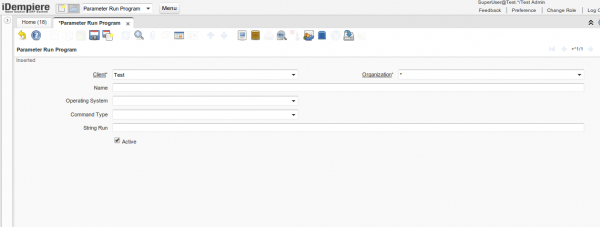
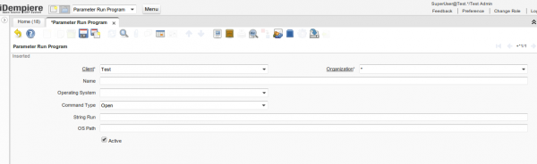
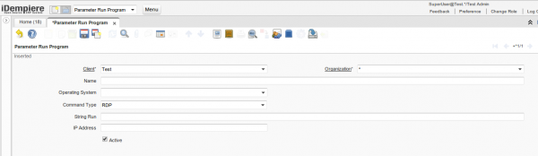
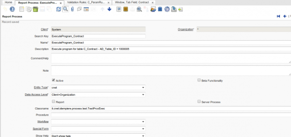
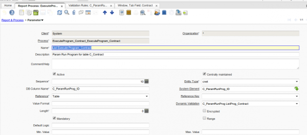
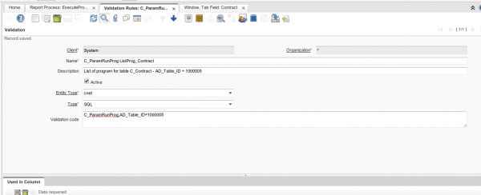
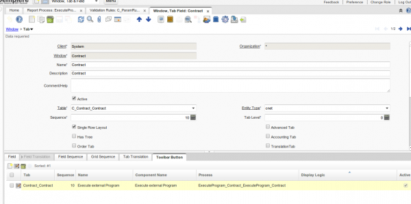

# Plugin EsecuzioneEsterna

---

## link esterni

---

## Riferimenti

* link pubblico          : non applicabile

* link idempiere italia  : https://bitbucket.org/consulnet/idempiere-ita-plugin 

* link jar               : 

* versione idempiere     : idempiere 3.1

* versione zk supportata : 

---

## Descrizione Plugin

Permettere di eseguire qualsiasi programma/comando al di fuori dell’application: esecuzione stringa da riga di comando.

---

## Funzionalità supportate

---

## Installazione Plugin

Installare nella console felix il jar reperibile su [https://bitbucket.org/consulnet/idempiere-download idempiere-download]

---

## Parametrizzazione Plugin

---

## Istruzioni Plugin



A seconda del Command Type selezionato, vi è la comparsa di campi utili





Bisogna duplicare più processi per ogni tabella (per convenienza ora si fa così ...)



Es. Creazione del processo per C_Contract: utilizzo sempre della stessa classe Java, ma diversa dicitura del nome del processo.
Poi anche per il parametro: stesso parametro, ma Dynamic Validation che cambia a seconda della tabella





Nella Dynamic Validation - Validation Rule in questione, bisogna settare l'id corrispondente nella tabella. Una volta settati i dati relativi al processo, verrà richiamato nella Toolbar button relativa alla maschera della C_Contract



## Documentazione Tecnica Plugin

---

## Modifiche all'AD

### Tables / Windows esistente

### Nuove Tables /Windows

------------------
```
| C_ParamRunProg |

| nome campo     | descrizione                        	|

| OS         	 | tipo sistema operativo             	|

| CmdType    	 | tipo di comando ("open" per        	|
|            	 | programmi/file, "rdp" per          	|

|            	 | connessioni..)                     	|

| StringRun  	 | stringa di comando                 	|

| Path        	 | percorso di una cartella specifica 	|

| IP          	 | indirizzo ip macchina a cui ci si  	|

|             	 | vuole collegare                    	|
```

---

## Funzionalità Future

---

## Errori e bug

---